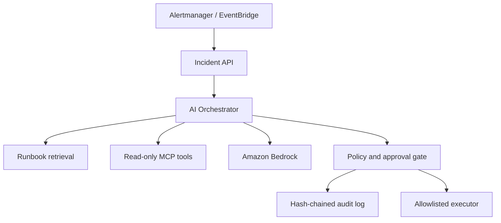

# SentinelOps AI

Human-governed AI incident response for Kubernetes platforms.

[](https://github.com/vamshiKnemuri/sentinelops-ai-platform/actions/workflows/ci.yml)
[](LICENSE)

SentinelOps ingests production alerts, retrieves relevant runbooks, gathers read-only evidence through MCP tools, and asks Amazon Bedrock for a structured diagnosis. It never performs a mutating action directly: remediation proposals pass through policy checks, require a short-lived human approval, and produce a tamper-evident audit trail.

This is a senior platform-engineering project rather than a chatbot demo. It combines AI engineering, SRE operations, Kubernetes, security controls, evaluation, observability, infrastructure as code, and controlled teardown.

## Project status

| Capability | Current evidence |
|---|---|
| Application and AI safety | Unit tests and golden incident evaluations run in GitHub Actions |
| Container security | Image build and Trivy vulnerability scan run in GitHub Actions |
| Platform validation | Terraform validation, Helm linting, and IaC scanning run in GitHub Actions |
| Local demonstration | Deterministic provider supports a credential-free, reproducible walkthrough |
| AWS demonstration | Infrastructure and guarded deploy/destroy workflows are implemented; deployment evidence is not yet published |

The repository was publicly released as a portfolio case study. Public commit dates represent the publication and subsequent improvement history. See [CHANGELOG.md](CHANGELOG.md), [ROADMAP.md](ROADMAP.md), and the [architecture decisions](docs/adr/README.md).

## What it demonstrates

| Area | Implementation |
|---|---|
| AI reasoning | Amazon Bedrock Converse API with a provider-neutral model adapter |
| RAG | Ranked retrieval over versioned runbooks with evidence citations |
| Agent tooling | MCP server exposing bounded, read-only Kubernetes, Prometheus, deployment, and runbook tools |
| Human governance | Policy engine, expiring HMAC approvals, allowlisted remediation types, simulation-first execution |
| AI safety | Prompt-injection boundaries, structured outputs, evidence requirements, confidence thresholds, audit chain |
| Reliability | Idempotent incident processing, health checks, timeouts, retries, dead-letter-ready event model |
| Platform | Docker, Kubernetes, Helm, EKS, Terraform, GitHub OIDC, GitHub Actions, Argo CD |
| Observability | Prometheus metrics and OpenTelemetry-ready tracing for latency, tokens, tool calls, denials, and approvals |
| Quality | Unit tests plus golden incident evaluations for diagnosis, citations, and unsafe-action rejection |

## Architecture



## Local quick start

Python 3.12 is required.

```bash
python -m venv .venv
source .venv/bin/activate
python -m pip install -e '.[dev]'
pytest
sentinelops-api
```

In another terminal:

```bash
curl -sS -X POST http://127.0.0.1:8080/v1/incidents/analyze \
  -H 'content-type: application/json' \
  --data @examples/alerts/crashloop.json | python -m json.tool
```

The default `deterministic` provider makes the entire workflow testable without credentials. To run real inference, configure AWS credentials and set:

```bash
export SENTINELOPS_LLM_PROVIDER=bedrock
export SENTINELOPS_BEDROCK_MODEL_ID=amazon.nova-lite-v1:0
export AWS_REGION=us-east-1
```

## Safety contract

- AI and MCP diagnostic tools are read-only.
- Retrieved documents are treated as untrusted data, never as instructions.
- Every conclusion must cite retrieved or observed evidence.
- Low-confidence reports recommend escalation rather than action.
- Mutating actions require policy approval and a user-supplied, short-lived approval token.
- Real Kubernetes mutations are disabled by default; the portfolio demo uses a simulated executor.

See [the architecture](docs/ARCHITECTURE.md), [security model](docs/SECURITY.md), and [evaluation strategy](docs/EVALUATION.md).

## Temporary AWS deployment

The AWS environment is intentionally short-lived and billable. The deploy workflow provisions EKS, two EC2 workers, one NAT gateway, KMS keys, DynamoDB, SQS, S3, ECR, and Bedrock inference access. Destroy it immediately after recording the demonstration.

1. Create the `sentinelops-ai-platform` GitHub repository and push `main`.
2. Create the `sentinelops-github-bootstrap` CloudFormation stack from `bootstrap/aws-oidc-role.yaml`.
3. Create a protected GitHub environment named `demo`.
4. Add repository variables `AWS_ROLE_ARN`, `AWS_REGION`, `TF_STATE_BUCKET`, and `BEDROCK_MODEL_ID`.
5. Confirm CI is green, then manually run `Deploy AWS Demo` with `DEPLOY`.
6. Follow [the demonstration runbook](docs/DEMO.md).
7. Run `Destroy AWS Demo` with `DESTROY` and remove the bootstrap stack when finished.

## Portfolio story

SentinelOps is designed to support a senior-level interview narrative: define the operating problem, explain the control plane, demonstrate an incident, show the evidence and model decision, approve a bounded remediation, verify recovery, inspect AI telemetry, and prove cleanup.

## License

MIT
