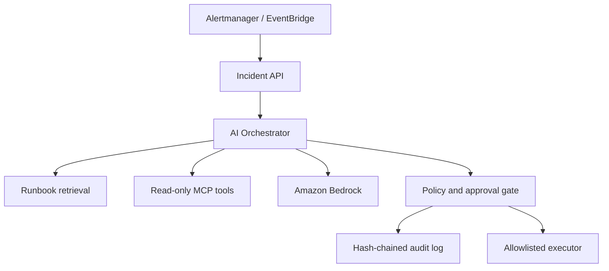

# SentinelOps AI

Human-governed AI incident response for Kubernetes platforms.

[](https://github.com/vamshiKnemuri/sentinelops-ai-platform/actions/workflows/ci.yml)
[](LICENSE)

SentinelOps ingests production alerts, retrieves relevant runbooks, gathers read-only evidence through MCP tools, and asks Amazon Bedrock for a structured diagnosis. The response contains cited hypotheses, uncertainty, and a bounded next action. It never performs a mutating action directly: remediation proposals pass through policy checks, require a short-lived human approval, and produce a tamper-evident audit trail.

The design keeps the model inside a deterministic control plane. Retrieval, citations, action risk, approval, token replay, and audit integrity are enforced in code rather than delegated to the prompt.

## Project status

| Capability | Current evidence |
|---|---|
| Application and AI safety | Unit tests and four golden scenarios, including prompt injection and insufficient evidence, run in GitHub Actions |
| Container security | Image build and Trivy vulnerability scan run in GitHub Actions |
| Platform validation | Terraform validation, Helm linting, and IaC scanning run in GitHub Actions |
| Local demonstration | Deterministic provider supports a credential-free, reproducible walkthrough |
| AWS demonstration | Infrastructure and guarded deploy/destroy workflows are implemented; deployment evidence is not yet published |

See [CHANGELOG.md](CHANGELOG.md), [ROADMAP.md](ROADMAP.md), and the [architecture decisions](docs/adr/README.md) for the implementation history and explicit trade-offs.

## What it demonstrates

| Area | Implementation |
|---|---|
| AI reasoning | Amazon Bedrock Converse API with a versioned, provider-neutral decision contract |
| RAG | Ranked retrieval over versioned runbooks with evidence citations |
| Agent tooling | MCP server exposing bounded, read-only Kubernetes, Prometheus, deployment, and runbook tools |
| Human governance | Policy engine, expiring HMAC approvals, allowlisted remediation types, simulation-first execution |
| AI safety | Untrusted-input boundaries, structured hypotheses, citation checks, confidence thresholds, fail-closed provider behavior |
| Reliability | Idempotent incident processing, health checks, timeouts, retries, dead-letter-ready event model |
| Platform | Docker, Kubernetes, Helm, EKS, Terraform, GitHub OIDC, GitHub Actions, Argo CD |
| Observability | Prometheus metrics, allowlisted OpenTelemetry spans, and a versioned Grafana dashboard |
| Quality | Unit tests plus golden evaluations for retrieval, citation validity, escalation, and unsafe-action rejection |

## Architecture



## Local quick start

Python 3.12 is required.

```bash
python -m venv .venv
source .venv/bin/activate
python -m pip install -e '.[dev]'
pytest
sentinelops-api
```

In another terminal:

```bash
curl -sS -X POST http://127.0.0.1:8080/v1/incidents/analyze \
  -H 'content-type: application/json' \
  --data @examples/alerts/crashloop.json | python -m json.tool
```

The default `deterministic` provider makes the entire workflow testable without credentials. To run real inference, configure AWS credentials and set:

```bash
export SENTINELOPS_LLM_PROVIDER=bedrock
export SENTINELOPS_BEDROCK_MODEL_ID=amazon.nova-lite-v1:0
export AWS_REGION=us-east-1
```

## Safety contract

- AI and MCP diagnostic tools are read-only.
- Retrieved documents are treated as untrusted data, never as instructions.
- Every conclusion must cite retrieved or observed evidence.
- The model returns concise hypotheses and verification steps, not hidden chain-of-thought.
- Low-confidence reports recommend escalation rather than action.
- Invalid model output or a Bedrock failure degrades to a non-mutating human escalation.
- Policy code verifies the declared risk for every allowlisted action.
- Mutating actions require policy approval and a user-supplied, short-lived approval token.
- Real Kubernetes mutations are disabled by default; the portfolio demo uses a simulated executor.

See [the architecture](docs/ARCHITECTURE.md), [security model](docs/SECURITY.md), and [evaluation strategy](docs/EVALUATION.md).

Durable AWS mode uses conditional DynamoDB writes for incidents, approvals, replay protection, and the audit chain, plus checksum-verified S3 runbooks. See [persistence](docs/PERSISTENCE.md) and [observability](docs/OBSERVABILITY.md).

## Deliberate limitations

- Local mode intentionally uses in-memory storage; AWS mode selects the DynamoDB and S3 adapters through environment configuration.
- The bundled Kubernetes diagnostic is simulated. The MCP boundary is real, but live cluster readers are intentionally not enabled in the portfolio mode.
- Trace export is opt-in and requires an OTLP endpoint; trace attributes are allowlisted and never include incident payloads or credentials.
- AWS infrastructure and guarded deploy/destroy workflows are implemented, but no live AWS deployment evidence is claimed yet.

## Temporary AWS deployment

The AWS environment is intentionally short-lived and billable. The deploy workflow provisions EKS, two EC2 workers, one NAT gateway, KMS keys, DynamoDB, SQS, S3, ECR, and Bedrock inference access. Destroy it immediately after recording the demonstration.

1. Create the `sentinelops-github-bootstrap` CloudFormation stack from `bootstrap/aws-oidc-role.yaml`.
2. Create a protected GitHub environment named `demo`.
3. Add repository variables `AWS_ROLE_ARN`, `AWS_REGION`, `TF_STATE_BUCKET`, and `BEDROCK_MODEL_ID`.
4. Confirm CI is green, then manually run `Deploy AWS Demo` with `DEPLOY`.
5. Follow [the demonstration runbook](docs/DEMO.md).
6. Run `Destroy AWS Demo` with `DESTROY` and remove the bootstrap stack when finished.

## Portfolio story

SentinelOps is designed to support a senior-level interview narrative: define the operating problem, explain the control plane, demonstrate an incident, show the evidence and model decision, approve a bounded remediation, verify recovery, inspect AI telemetry, and prove cleanup.

## License

MIT
