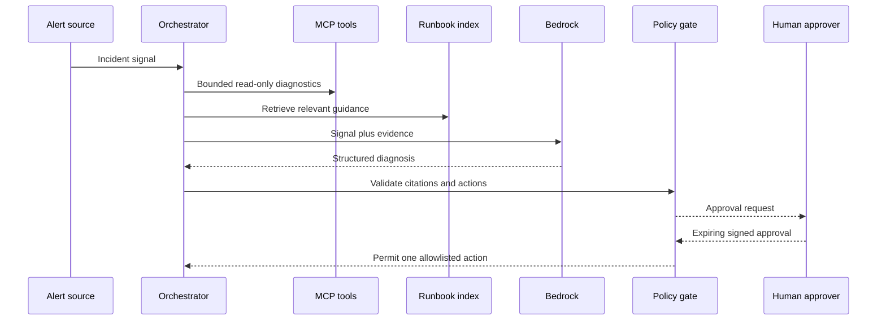

# Architecture

## Design objective

SentinelOps reduces incident-investigation time without delegating uncontrolled production authority to an LLM. The model is one bounded component inside a deterministic control plane.

## Control flow

## Trust boundaries

| Boundary | Control |
|---|---|
| Alert input | Pydantic schemas, size limits, controlled label count |
| Retrieved text | Delimited as untrusted evidence; cannot define tools or permissions |
| MCP tools | Read-only registry; bounded parameters and timeouts |
| LLM output | Strict schema validation, citation validation, action allowlist |
| Remediation | Separate approval token tied to incident, action, identity, and expiry |
| Audit | Hash-linked events; production adapter persists immutable records |
| AWS | Pod identity/IRSA and least-privilege Bedrock permissions |

## Failure behavior

- A failed diagnostic tool becomes an explicit bounded observation; other evidence remains usable.
- Missing retrieval results force original-signal evidence and lower-confidence escalation.
- Invalid model JSON, invented citations, or unsafe actions fail closed.
- Duplicate alerts map to the same incident identity and do not duplicate analysis side effects.
- The deterministic provider supports local development and repeatable evaluation; it is never presented as live AI.

## Deployment modes

- `local`: deterministic provider, in-memory storage, simulated Kubernetes health.
- `aws-demo`: Bedrock provider, EKS, IRSA, S3 runbooks, DynamoDB incident/audit state, Prometheus/Grafana.
- `production-reference`: private EKS endpoint, internal runners, multi-AZ persistence, enterprise identity, Slack/ServiceNow adapters, and managed secrets.
